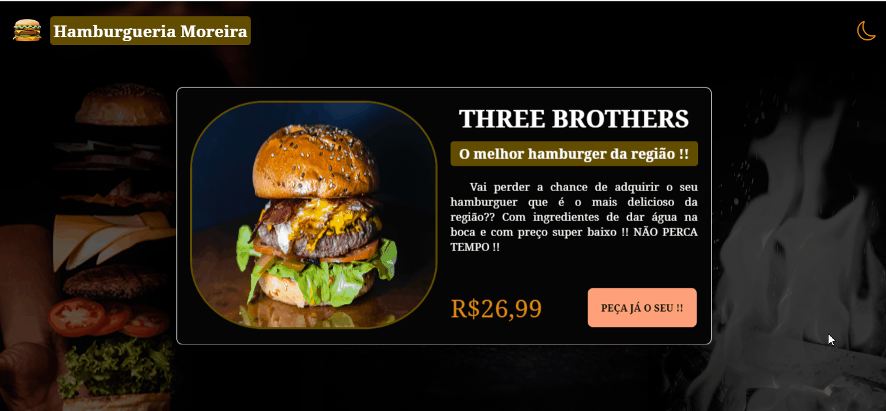

# Projeto - Dark Mode
Um projeto que buscou demontrar a criação de um dark mode para uma hamburgueria, com um dos lanches oferecidos pela empresa. Design, desenvolvimento de códigos e toda estrutura pensadas de maneira fácil e compreensiva. Com o acionamento do dark mode, há a mudança de alguns componentes do projeto, demonstrando a textura de cores escuras e claras.🚀❤🙌

[]

## Tecnologias utilizadas 🚀
- HTML5
- CSS3
- JAVASCRIPT
- PHOTOSHOP

## Por que desenvolvi o projeto ?

Este trabalho foi desenvolvido com intuito de demonstrar minhas habilidades com a programação por meio da elaboração de um dark mode para uma hamburgeria através de um de seus lanches oferecidos. O projeto mostra a mudança de coloração de alguns de seus componentes, confirmando a sua funcionalidade e eficácia. O design também foi deenvolvido por mim com auxílio da ferramenta photoshop. Espero que curtam e ajude compartilhando !!!

Feito com ❤ por Fabiano Dias Moreira 👏 [Veja meu linkedIn](https://www.linkedin.com/in/fabiano-dias-moreira-b851b7217/)